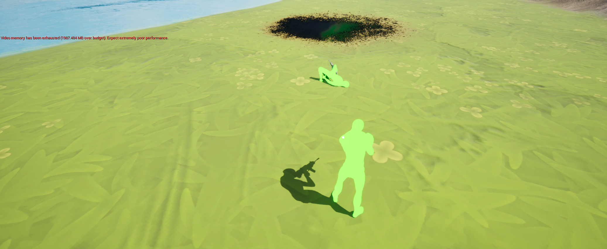

### UE5 MultiPlayer Third-Person Shooter

This project is a **Multiplayer Third-Person Shooter (TPS)** developed in **Unreal Engine 5** using Blueprints. The project is designed to provide a foundation for a multiplayer game, allowing players to engage in combat from a third-person perspective. The game utilizes UE5's advanced features for high-quality rendering, physics, and networking. 

 

#### Key Features:
1. **Third-Person Character Movement**: A fully implemented third-person character controller, allowing smooth movement, jumping, and running animations.
2. **Multiplayer Functionality**: Supports multiplayer gameplay with a server-client architecture, built using UE5’s replication system for synchronizing player states and actions across the network.
3. **Combat System**: Includes shooting mechanics with projectile-based weapons, hit detection, and health system. The combat is integrated with both single-player and multiplayer modes.
4. **Animations**: The project uses a blend of custom and Unreal Engine’s default animations to provide a realistic third-person experience. Features include idle, walking, running, and shooting animations.
5. **Customizable Blueprints**: All gameplay elements are created using Blueprints, providing an accessible way to extend or modify the game without needing C++ code. Key components such as character movement, health system, weapon mechanics, and networking are structured for easy customization.
6. **User Interface (UI)**: Includes a basic HUD showing health, ammo, and player stats, with the possibility of expanding the UI for more advanced gameplay elements.
7. **Environment & Maps**: Pre-configured sample maps for multiplayer gameplay, complete with spawn points, interactive elements, and environmental features.
8. **Replication and Networking**: Handles character movements, shooting, and player interactions over a network using Unreal Engine's built-in replication features.
